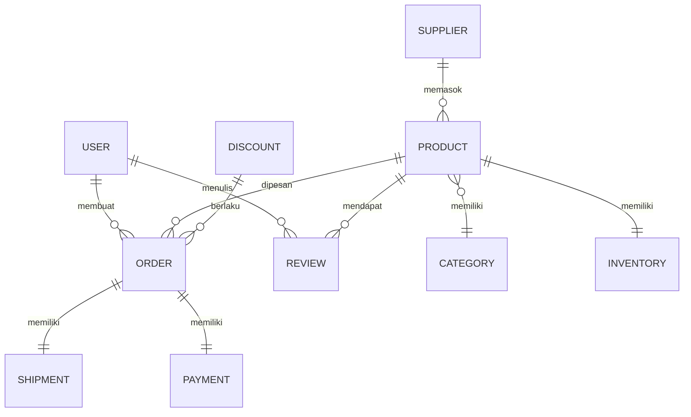

# Dokumentasi Proyek RESTful API - Web Services

**Mata Kuliah:** Web Services  
**Topik:** Tugas Membuat API dengan RESTful (10 Services)  
**Nama Proyek:** `module5`  
**Base URL:** `http://localhost:67`

---

## ⚠️ Peringatan Penting

Proyek ini menggunakan **Spring Boot versi 4.0.6**. Saat ini berjalan normal dan aman.

Namun, jika Anda mengalami error seperti `ClassNotFoundException: org.hibernate.dialect.MySQL8Dialect` atau kendala lain yang terkait dengan versi, Anda dapat **downgrade ke versi stabil 3.2.5** dengan langkah berikut:

1. Buka `pom.xml`, ubah `parent` version menjadi:
   ```xml
   <version>3.2.5</version>
2. Hapus dependensi `spring-boot-starter-data-jpa-test` dan `spring-boot-starter-webmvc-test`.
3. Ganti `spring-boot-starter-webmvc` dengan `spring-boot-starter-web`.
4. Reload Maven.

---

## Daftar Isi
1. [Deskripsi Proyek](#deskripsi-proyek)
2. [Struktur Proyek (Awal)](#struktur-proyek-awal)
3. [Struktur Folder Target (10 Entitas)](#struktur-folder-target-10-entitas)
4. [Persiapan Lingkungan](#persiapan-lingkungan)
5. [Konfigurasi Database](#konfigurasi-database)
6. [Entitas yang Telah Disediakan (User)](#entitas-yang-telah-disediakan-user)
7. [Tugas Mahasiswa: Melengkapi 9 Entitas](#tugas-mahasiswa-melengkapi-9-entitas)
   - 7.1 Product
   - 7.2 Order
   - 7.3 Category
   - 7.4 Review
   - 7.5 Supplier
   - 7.6 Inventory
   - 7.7 Shipment
   - 7.8 Payment
   - 7.9 Discount
8. [Cara Menjalankan Aplikasi](#cara-menjalankan-aplikasi)
9. [Pengujian API dengan Postman](#pengujian-api-dengan-postman)
10. [Tugas Praktikum Lanjutan](#tugas-praktikum-lanjutan)
11. [Flow Lengkap Sistem (10 Entitas)](#flow-lengkap-sistem-10-entitas)
12. [Troubleshooting](#troubleshooting)
13. [Kesimpulan](#kesimpulan)

---

## Deskripsi Proyek

Proyek ini adalah aplikasi **Spring Boot** yang menyediakan **RESTful API** untuk manajemen **10 entitas** dalam sebuah ekosistem e-commerce.

**Kode awal hanya menyediakan entitas `User`** (lengkap dengan CRUD dan 2 custom query).  
Mahasiswa **wajib melengkapi 9 entitas lainnya**:

1. Product (Manajemen produk)
2. Order (Manajemen pesanan)
3. Category (Manajemen kategori produk)
4. Review (Manajemen ulasan produk)
5. Supplier (Manajemen pemasok)
6. Inventory (Manajemen inventaris)
7. Shipment (Manajemen pengiriman)
8. Payment (Manajemen pembayaran)
9. Discount (Manajemen diskon)

Setiap entitas harus memiliki **CRUD lengkap** (GET, POST, PUT, DELETE) serta **minimal satu custom query**.

---

## Struktur Proyek (Awal)

Saat ini (sebelum tugas dikerjakan), hanya entitas **User** yang tersedia:

```
module5/
├── src/main/java/com/wsb/module5/
│   ├── controller/
│   │   └── UserController.java          ✅ sudah ada
│   ├── model/
│   │   └── User.java                    ✅ sudah ada
│   ├── repository/
│   │   └── UserRepository.java          ✅ sudah ada (dengan custom query)
│   ├── service/
│   │   └── UserService.java             ✅ sudah ada
│   └── Module5Application.java
├── src/main/resources/
│   └── application.properties           ✅ konfigurasi database
└── pom.xml                              ⚠️ perlu diperbaiki
```

> **Catatan:** Mahasiswa harus menambahkan package `model`, `repository`, `service`, `controller` untuk **9 entitas lainnya**.

---

## Struktur Folder Target (10 Entitas)

Setelah semua entitas selesai, struktur akhir yang harus dicapai:

```
module5/
├── src/main/java/com/wsb/module5/
│   ├── controller/
│   │   ├── UserController.java           ✅
│   │   ├── ProductController.java        ❌ perlu ditambahkan
│   │   ├── OrderController.java          ❌ perlu ditambahkan
│   │   ├── CategoryController.java       ❌ perlu ditambahkan
│   │   ├── ReviewController.java         ❌ perlu ditambahkan
│   │   ├── SupplierController.java       ❌ perlu ditambahkan
│   │   ├── InventoryController.java      ❌ perlu ditambahkan
│   │   ├── ShipmentController.java       ❌ perlu ditambahkan
│   │   ├── PaymentController.java        ❌ perlu ditambahkan
│   │   └── DiscountController.java       ❌ perlu ditambahkan
│   ├── model/
│   │   ├── User.java                     ✅
│   │   ├── Product.java                  ❌ perlu ditambahkan
│   │   ├── Order.java                    ❌ perlu ditambahkan
│   │   ├── Category.java                 ❌ perlu ditambahkan
│   │   ├── Review.java                   ❌ perlu ditambahkan
│   │   ├── Supplier.java                 ❌ perlu ditambahkan
│   │   ├── Inventory.java                ❌ perlu ditambahkan
│   │   ├── Shipment.java                 ❌ perlu ditambahkan
│   │   ├── Payment.java                  ❌ perlu ditambahkan
│   │   └── Discount.java                 ❌ perlu ditambahkan
│   ├── repository/
│   │   ├── UserRepository.java           ✅
│   │   └── (9 repository interfaces)     ❌ perlu ditambahkan
│   └── service/
│       ├── UserService.java              ✅
│       └── (9 service classes)           ❌ perlu ditambahkan
└── ...
```

**Keterangan:**  
✅ = sudah disediakan (hanya User)  
❌ = wajib dibuat oleh mahasiswa (9 entitas)

Base path endpoint REST:
- `/api/users`
- `/api/products`
- `/api/orders`
- `/api/categories`
- `/api/reviews`
- `/api/suppliers`
- `/api/inventories`
- `/api/shipments`
- `/api/payments`
- `/api/discounts`

---

## Persiapan Lingkungan

| Alat/Bahan | Versi Minimal |
|------------|---------------|
| Java JDK | 11 atau 17 |
| MySQL Server | 8.0 |
| IDE (VS Code, IntelliJ, Eclipse) | - |
| Postman / cURL | - |
| Maven | 3.6+ |

---

## Konfigurasi Database

File `application.properties` (sudah disediakan):

```properties
spring.application.name=module5
server.port=67

spring.jpa.hibernate.ddl-auto=update
spring.datasource.url=jdbc:mysql://localhost:3306/restful_api_db?createDatabaseIfNotExist=true&useSSL=false&allowPublicKeyRetrieval=true&serverTimezone=UTC
spring.datasource.username=root
spring.datasource.password=    # isi password MySQL Anda
spring.datasource.driver-class-name=com.mysql.cj.jdbc.Driver
```

> Database `restful_api_db` akan otomatis dibuat.

---

## Entitas yang Telah Disediakan (User)

Sebagai referensi pola, berikut implementasi `User`:

### Model (`User.java`)
```java
@Entity @Table(name = "users")
@Data @NoArgsConstructor @AllArgsConstructor
public class User {
    @Id @GeneratedValue(strategy = GenerationType.IDENTITY)
    private Long id;
    private String name;
    @Column(unique = true)
    private String email;
    private String phone;
}
```

### Repository (`UserRepository.java`)
```java
@Repository
public interface UserRepository extends JpaRepository<User, Long> {
    List<User> findByName(String name);
    @Query("SELECT u FROM User u WHERE LOWER(u.email) LIKE LOWER(CONCAT('%', :keyword, '%'))")
    List<User> findByEmailContaining(@Param("keyword") String keyword);
}
```

### Service (`UserService.java`) → CRUD standar + `getUsersByName` + `searchUsersByEmailKeyword`

### Controller (`UserController.java`) → endpoint standar + `/search/name` + `/search/email-keyword`

---

## Tugas Mahasiswa: Melengkapi 9 Entitas

**Ikuti pola User di atas** untuk setiap entitas berikut.  
Setiap entitas minimal memiliki 1 custom query (contoh diberikan).  
**Jangan lupa menambahkan relasi foreign key** sesuai diagram relasi (lihat bagian Flow).

---

### 7.1 Product (Manajemen Produk)

**Model** (`Product.java`):
```java
@Entity @Table(name = "products")
@Data @NoArgsConstructor @AllArgsConstructor
public class Product {
    @Id @GeneratedValue(strategy = GenerationType.IDENTITY)
    private Long id;
    private String name;
    private String description;
    private Double price;
    private Integer stock;
    private Long categoryId;   // foreign key ke categories.id
    private Long supplierId;   // foreign key ke suppliers.id
}
```

**Custom query contoh:** `List<Product> findByPriceBetween(Double min, Double max)`

**Endpoint:** `/api/products`

---

### 7.2 Order (Manajemen Pesanan)

**Model**:
```java
@Entity @Table(name = "orders")
@Data @NoArgsConstructor @AllArgsConstructor
public class Order {
    @Id @GeneratedValue(strategy = GenerationType.IDENTITY)
    private Long id;
    private Long userId;
    private Long productId;
    private Integer quantity;
    private Double totalPrice;
    private String status; // PENDING, PAID, SHIPPED, DELIVERED
    private Long discountId; // opsional, foreign key ke discounts.id
    private LocalDateTime orderDate;
}
```

**Custom query:** `List<Order> findByUserId(Long userId)`

**Endpoint:** `/api/orders`

---

### 7.3 Category (Manajemen Kategori)

**Model**:
```java
@Entity @Table(name = "categories")
@Data @NoArgsConstructor @AllArgsConstructor
public class Category {
    @Id @GeneratedValue(strategy = GenerationType.IDENTITY)
    private Long id;
    private String name;
    private String description;
}
```

**Custom query:** `Category findByName(String name)`

**Endpoint:** `/api/categories`

---

### 7.4 Review (Manajemen Ulasan)

**Model**:
```java
@Entity @Table(name = "reviews")
@Data @NoArgsConstructor @AllArgsConstructor
public class Review {
    @Id @GeneratedValue(strategy = GenerationType.IDENTITY)
    private Long id;
    private Long productId;
    private Long userId;
    private Integer rating; // 1-5
    private String comment;
    private LocalDateTime createdAt;
}
```

**Custom query:** `List<Review> findByProductId(Long productId)`

**Endpoint:** `/api/reviews`

---

### 7.5 Supplier (Manajemen Pemasok)

**Model**:
```java
@Entity @Table(name = "suppliers")
@Data @NoArgsConstructor @AllArgsConstructor
public class Supplier {
    @Id @GeneratedValue(strategy = GenerationType.IDENTITY)
    private Long id;
    private String name;
    private String contactPerson;
    private String phone;
    private String email;
    private String address;
}
```

**Custom query:** `Supplier findByName(String name)`

**Endpoint:** `/api/suppliers`

---

### 7.6 Inventory (Manajemen Inventaris)

**Model**:
```java
@Entity @Table(name = "inventories")
@Data @NoArgsConstructor @AllArgsConstructor
public class Inventory {
    @Id @GeneratedValue(strategy = GenerationType.IDENTITY)
    private Long id;
    private Long productId;
    private Integer stockAvailable;
    private String location;
    private LocalDateTime lastUpdated;
}
```

**Custom query:** `List<Inventory> findByProductId(Long productId)`

**Endpoint:** `/api/inventories`

---

### 7.7 Shipment (Manajemen Pengiriman)

**Model**:
```java
@Entity @Table(name = "shipments")
@Data @NoArgsConstructor @AllArgsConstructor
public class Shipment {
    @Id @GeneratedValue(strategy = GenerationType.IDENTITY)
    private Long id;
    private Long orderId;
    private String trackingNumber;
    private String carrier;
    private LocalDateTime shippedDate;
    private LocalDateTime deliveredDate;
    private String status; // PROCESSING, SHIPPED, DELIVERED
}
```

**Custom query:** `Shipment findByOrderId(Long orderId)`

**Endpoint:** `/api/shipments`

---

### 7.8 Payment (Manajemen Pembayaran)

**Model**:
```java
@Entity @Table(name = "payments")
@Data @NoArgsConstructor @AllArgsConstructor
public class Payment {
    @Id @GeneratedValue(strategy = GenerationType.IDENTITY)
    private Long id;
    private Long orderId;
    private Double amount;
    private String method; // CREDIT_CARD, BANK_TRANSFER, COD
    private String status; // PENDING, SUCCESS, FAILED
    private LocalDateTime paymentDate;
}
```

**Custom query:** `List<Payment> findByStatus(String status)`

**Endpoint:** `/api/payments`

---

### 7.9 Discount (Manajemen Diskon)

**Model**:
```java
@Entity @Table(name = "discounts")
@Data @NoArgsConstructor @AllArgsConstructor
public class Discount {
    @Id @GeneratedValue(strategy = GenerationType.IDENTITY)
    private Long id;
    private String code;
    private Double percentage;
    private Double nominal;
    private LocalDateTime validFrom;
    private LocalDateTime validUntil;
    private Boolean active;
}
```

**Custom query:** `List<Discount> findByActiveTrue()`

**Endpoint:** `/api/discounts`

---

## Cara Menjalankan Aplikasi

1. **Import proyek** ke IDE.
2. **Pastikan MySQL** berjalan.
3. **Isi password** di `application.properties`.
4. **Perbaiki `pom.xml`** (downgrade ke 3.2.5) jika perlu.
5. **Build**:
   ```bash
   mvn clean install
   ```
6. **Jalankan**:
   ```bash
   mvn spring-boot:run
   ```
   Aplikasi berjalan di `http://localhost:67`.

---

## Pengujian API dengan Postman

Contoh untuk User (endpoint lain serupa dengan base path masing-masing):

| Operasi | Method | URL | Body (JSON) |
|----------|--------|-----|--------------|
| GET all | GET | `http://localhost:67/api/users` | - |
| POST | POST | `http://localhost:67/api/users` | `{"name":"Budi","email":"budi@mail.com","phone":"0812"}` |
| Search by name | GET | `http://localhost:67/api/users/search/name?name=Budi` | - |

### Contoh cURL
```bash
curl -X GET http://localhost:67/api/users
curl -X POST http://localhost:67/api/products -H "Content-Type: application/json" -d '{"name":"Laptop","price":15000000,"stock":5}'
```

---

## Tugas Praktikum Lanjutan (Nilai Tambahan)

1. **Dokumentasi API dengan Swagger** – tambahkan dependensi `springdoc-openapi`.
2. **Validasi Input** – gunakan `@NotBlank`, `@Min`, `@Valid` di controller.
3. **Global Exception Handling** – buat `@ControllerAdvice`.
4. **Keamanan** – Spring Security (basic auth atau JWT).

---

## Flow Lengkap Sistem (10 Entitas)

### Diagram Relasi



### Detail Kolom Tabel (Ringkasan)

| Tabel | Kolom Kunci |
|-------|-------------|
| `users` | id, name, email, phone |
| `categories` | id, name, description |
| `suppliers` | id, name, contact_person, phone, email, address |
| `products` | id, name, description, price, stock, category_id, supplier_id |
| `inventories` | id, product_id, stock_available, location, last_updated |
| `orders` | id, user_id, product_id, quantity, total_price, status, discount_id, order_date |
| `payments` | id, order_id, amount, method, status, payment_date |
| `shipments` | id, order_id, tracking_number, carrier, shipped_date, delivered_date, status |
| `discounts` | id, code, percentage, nominal, valid_from, valid_until, active |
| `reviews` | id, product_id, user_id, rating, comment, created_at |

### Alur Bisnis Singkat

1. **Admin** menambah Category, Supplier, Product, Inventory, Discount.
2. **User** register, login, lihat produk, buat Order → sistem buat Payment & Shipment status PENDING, kurangi stok.
3. **User** bayar (update Payment status SUCCESS) → Order status PAID.
4. **Admin** update Shipment (tracking, shipped_date) → status SHIPPED.
5. **User** terima barang, admin update shipment status DELIVERED → Order status DELIVERED.
6. **User** memberi Review pada produk.

---

## Troubleshooting

| Error | Solusi |
|-------|--------|
| `Access denied for user 'root'@'localhost'` | Periksa password di `application.properties` |
| `Public Key Retrieval is not allowed` | Gunakan `?allowPublicKeyRetrieval=true` (sudah ada) |
| `Port 67 already in use` | Ganti `server.port=8080` atau hentikan proses lain |
| `Table 'xxx' doesn't exist` | Pastikan `ddl-auto=update` dan aplikasi pernah berjalan |
| `ClassNotFoundException: MySQL8Dialect` | Downgrade Spring Boot ke 3.2.5 (lihat peringatan) |

---

## Kesimpulan

Setelah menyelesaikan praktikum ini, mahasiswa diharapkan mampu:
- Mengembangkan RESTful API dengan Spring Boot untuk 10 entitas.
- Menerapkan CRUD dan custom query menggunakan Spring Data JPA.
- Menguji API menggunakan Postman/cURL.
- Menambahkan validasi, exception handling, dan keamanan.
- Memahami relasi dan alur bisnis e-commerce sederhana.